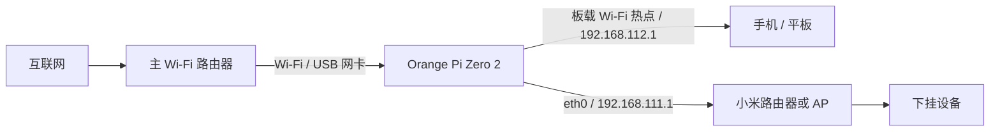

<div align="center">

# 📡 NetPulse-Pro · 网脉 Pro

**让经过开发板的流量看得见，让上网连接与无线热点管得清。**

面向 Orange Pi Zero 2 的轻量级网络管理面板：USB Wi‑Fi 上网、板载 Wi‑Fi 热点、有线下游、设备流量统计。


[](https://github.com/WU-AetherCore/NetPulse-Pro/actions/workflows/tests.yml)

[部署教程](docs/DEPLOYMENT.md) · [使用说明 / Web 介绍](docs/USER_GUIDE.md) · [常见问题](docs/TROUBLESHOOTING.md) · [API](docs/API.md) · [更新记录](CHANGELOG.md)

</div>

## 与 NetPulse 的关系

本项目基于作者的 [NetPulse](https://github.com/WU-AetherCore/NetPulse)，从实际运行的开发板版本整理而来。保留仪表盘、设备管理、历史流量、AdGuard Home 集成等功能，增加独立路由拓扑和可配置热点。

**Pro 的默认方案是让流量真实经过开发板，不再自动开启全局 ARP/NDP 欺骗。** 原有实验性相关接口仍保留，但不建议在本教程的路由拓扑中开启。

## ✨ 功能概览

| 页面 / 能力 | 内容 |
|---|---|
| 📊 仪表盘 | 在线设备、当前上传下载、累计流量、实时曲线、在线设备 TOP 10 |
| 📱 设备列表 | IP / MAC、名称、在线状态、历史流量、频段标记 |
| 🏆 流量排行 | 按时间范围及上传、下载、总量排序 |
| 📡 网络与热点 | USB 网卡选择、扫描 Wi‑Fi、手动输入 SSID、连接并保存 |
| ◉ 板载热点 | 修改热点名称、密码、2.4GHz 信道；应用失败恢复旧配置 |
| ⇄ 有线网络 | 查看链路状态与下游网关地址 |
| ▣ DHCP 地址 | 查看热点已分配地址及设备名称；不将租约误称为在线设备 |
| 📋 连接记录 | 设备发现、上线下线与管理事件 |
| 🛡️ AdGuard Home | 可选 DNS 统计、域名查询记录展示，需要单独配置 |
| ⚙️ 设备控制 | 保留封禁、限速、优先级接口，使用范围和限制见使用说明 |

## 🔌 推荐拓扑



| 网络角色 | 默认规划 | 说明 |
|---|---|---|
| USB 上游 | DHCP，从主路由器获取 | 网卡名称需按实际设备填写 |
| 有线下游 | `192.168.111.1/24` | DHCP 池 `.100`–`.220` |
| 板载热点 | `192.168.112.1/24` | DHCP 池 `.100`–`.220` |
| 热点名称 | `OrangePiZero2-AP` | 首次部署必须设置自己的密码 |
| Web | `8081` | 安装默认仅监听本机，按部署教程开放到可信内网 |

**上游、下游必须使用不重叠的网段。** 不需要修改主路由器。如果上游已使用 `192.168.111.0/24` 或 `192.168.112.0/24`，需先调整部署模板及相应代码中的固定下游地址，不能直接套用。

小米保留路由模式和自己的 DHCP 时：开发板 `eth0` 接小米 **WAN**，小米 LAN 可以继续使用 `192.168.1.1`；小米 WAN 使用开发板的 `192.168.111.x` 地址。在这个双重 NAT 结构中，开发板只能看到小米 WAN 的合计流量。要按手机分别统计，请连接板载热点，或让小米使用真正的有线 AP/桥接模式，由开发板统一分配地址。

## 🚀 安装入口

已验证的运行环境：Orange Pi Zero 2、Ubuntu 22.04 / Orange Pi 系统、Python 3.10、systemd、NetworkManager。其他发行版和无线驱动需自行验证。

```bash
git clone https://github.com/WU-AetherCore/NetPulse-Pro.git
cd NetPulse-Pro
sudo bash install.sh
```

脚本只安装应用及应用服务，不会自动改网口地址、连接 Wi‑Fi 或启动热点。**继续按 [完整部署教程](docs/DEPLOYMENT.md) 配置网络**。已有 NetPulse 使用同名 `netpulse.service`，安装会替换该应用服务；先备份原配置和数据库。

未开放内网监听前，可通过 SSH 隧道访问：

```bash
ssh -L 8081:127.0.0.1:8081 用户名@开发板地址
```

然后在电脑浏览器打开 `http://127.0.0.1:8081`。

## 📊 流量数据如何理解

- 上传：下游设备发出的转发数据；下载：送到下游设备的转发数据。
- 独立 `NETSTATS` / `NETSTATS6` 计数链按约 3 秒间隔取字节差值，界面使用 `KB/s` / `MB/s` 标签，内部按 1024 换算（实际为 KiB/s / MiB/s）。
- 已修复 `RETURN` 总计规则列错位造成“上传约等于上传＋下载”的错误，改用 `iptables-save -c` 的结构化规则文本解析。
- 只统计经过开发板的流量，不能看到同一 Wi‑Fi 中绕过开发板的设备流量。
- 总图与单设备数据采样时刻不同、IPv6覆盖不同，不保证逐点完全相等。跨两个下游网段的内部通信也可能同时计入上传和下载；该图不是运营商账单计量。
- 千兆网口协商速率是 1000Mbps（理论 125MB/s），不代表外网下载速度。USB 上游、无线干扰、驱动、CPU 和远端服务器都可能成为瓶颈。
- 板载热点默认保留 `802.11g / WPA2` 兼容参数：当前板卡开启 HT/WMM 时曾发生手机握手失败，不能承诺通过勾选高速模式达到更高速度。

## 🧭 Web 页面布局

网络设置页采用与仪表盘一致的紫色卡片布局，窄屏自动变为单列：

```text
网络与热点                                  [刷新状态]
主 Wi-Fi → USB 无线网卡 / Orange Pi → 热点 / 有线设备
┌ USB 无线上网 ─────────────────┐ ┌ 板载 Wi-Fi 热点 ────────────┐
│ 当前 SSID / IP / 网关 / 网卡   │ │ 运行状态 / 网关 / 安全模式   │
│ 网卡选择 / 扫描附近 Wi-Fi      │ │ 热点名称 / 新密码 / 信道     │
│ 连接名称 / 密码 / 连接并保存   │ │ 保存设置（提示重新连接）     │
└──────────────────────────────┘ └─────────────────────────────┘
┌ 有线网络 ────────────────────┐ ┌ 热点地址分配 ───────────────┐
│ 网线连接状态 / 开发板网关      │ │ 设备名称 / DHCP 地址        │
└──────────────────────────────┘ └─────────────────────────────┘
```

以上是布局示意，未把包含用户私人网络和设备信息的现场截图上传到仓库。

## 🗂️ 项目结构

```text
NetPulse-Pro/
├── app.py                  # Flask API / Web / 后台任务
├── config.py               # 可公开的配置默认值
├── database.py             # SQLite 存储
├── scanner.py              # 有线与热点设备发现
├── traffic.py              # 单设备内核流量统计
├── device_manager.py       # 设备控制与统计链维护
├── stats_counters.py       # 总流量计数解析（含 RETURN 回归修复）
├── wifi_manager.py         # NetworkManager 扫描与连接
├── uplink_manager.py       # 上游接口状态
├── network_settings.py     # 热点状态、校验、配置及回退
├── templates/              # 仪表盘和网络设置 Web 页面
├── deploy/                 # systemd / hostapd / DHCP / NAT 模板
├── tests/                  # 不操作真实网络的回归测试
├── docs/                   # 部署、使用、排错及 API 文档
├── env.example
└── install.sh
```

## 🧪 验证与局限

```bash
python3 -m venv .venv
.venv/bin/pip install -r requirements.txt
.venv/bin/python -m unittest discover -s tests -v
```

流量计数解析、热点参数校验、保留密码、失败恢复均有自动化测试。设备发现、热点联网和修复后的上下行差异已在开发板检查；安装脚本尚未在全新刷机设备上做完整验收。没有承诺所有网卡、路由器和操作系统即装即用。

**此版本没有完整的 Web 登录与权限隔离。** 旧代码的 `ADMIN_PASSWORD` 变量不能替代鉴权。默认仅监听 localhost，请使用 SSH 隧道或带认证的反向代理；不要直接暴露到公网。详情见 [安全说明](SECURITY.md)。

## 📄 开源与反馈

沿用原 NetPulse 的 [MIT License](LICENSE)。欢迎通过 [Issues](https://github.com/WU-AetherCore/NetPulse-Pro/issues) 报告问题；请附上拓扑、系统版本、网卡型号和脱敏日志，不要提交密码或数据库。
